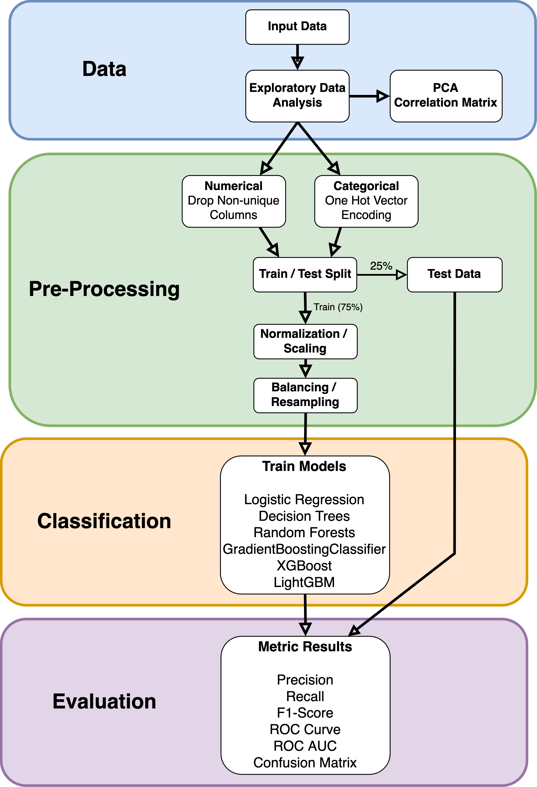

# Project:  &nbsp;&nbsp;Identifying Early Signs of Bank Account Fraud

***

<h3>Team Members:</h3> Anthony Coffin-Schmitt (awc93), Jackie Lasseter (jl2638), Elana Pocress (erp49)

<h3>Course Code:</h3> ORIE 5741 - Learning with Big Messy Data, Cornell University (Spring 2024)
 
 
<h3>Project Description</h3>

Our group is interested in exploring and applying machine learning / data modeling techniques to a large-scale complex
dataset to detect and predict fraud in bank account applications. We will ultilize a public tabular dataset that was 
generated on an anonymized, real-world bank account opening fraud detection dataset, see 
[Bank Account Fraud (BAF)](https://github.com/feedzai/bank-account-fraud).

Fraudulent applications in the financial sector carry significant risk to businesses and the public. Identity
theft, fraudulent credit and loan transactions, lost time and revenue are just a few of the risks from bank
fraud. The Federal Trade Commission [reported](https://www.ftc.gov/news-events/news/press-releases/2024/02/nationwide-fraud-losses-top-10-billion-2023-ftc-steps-efforts-protect-public)
over $10 Billion in financial fraud loss in 2023. Ideally to minimize losses, the fraud should be detected as early 
as possible and at the source of a new account application. Waiting to catch fraudulent transactions as they occur 
is inefficient and carries higher risk. This project proposes leveraging big data analytics techniques on a newly 
available BAF dataset, to identify warning signs of potential fraud in bank account applications.

<h3>Project Flowchart</h3>

